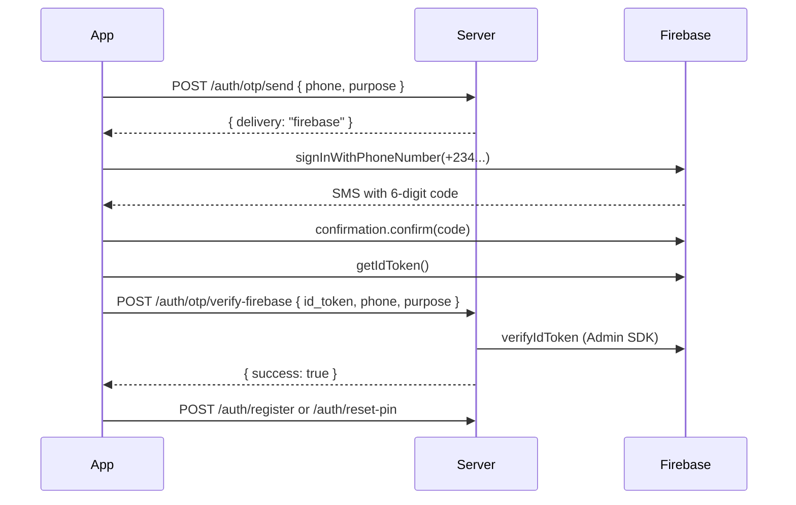

# Firebase Phone OTP Setup

Ahzarman uses **Firebase Phone Authentication** for SMS OTP during sign-up and forgot-PIN flows. Firebase must be configured on both the server and mobile app — there is no dev fallback.

## How it works



The server still enforces business rules (number not already registered for sign-up, account must exist for reset) before Firebase sends SMS.

---

## 1. Firebase Console

1. Go to [Firebase Console](https://console.firebase.google.com/) and create or open your project.
2. **Authentication → Sign-in method → Phone** — enable Phone.
3. Add your apps:
   - **Android** — package name: `com.ahzarman`
   - **iOS** — bundle ID: `com.ahzarman`

### Android SHA fingerprints

Firebase Phone Auth requires your app signing certificate fingerprints.

> **Paths depend on your current folder.** Your prompt was `android %` — that means use `app/debug.keystore`, not `android/app/debug.keystore`. From the `ahzarman/` root, use `android/app/debug.keystore`.

**Debug** — used when you run `npm run android` locally (`android/app/debug.keystore` exists in this project):

From **`ahzarman/`** (project root):

```bash
cd ~/Documents/cresendo24/azahman/ahzarman   # adjust to your path
keytool -list -v \
  -keystore android/app/debug.keystore \
  -alias androiddebugkey \
  -storepass android \
  -keypass android
```

From **`ahzarman/android/`** (where your terminal was):

```bash
keytool -list -v \
  -keystore app/debug.keystore \
  -alias androiddebugkey \
  -storepass android \
  -keypass android
```

| Flag | Value |
|------|--------|
| `-keystore` | `app/debug.keystore` if cwd is `android/`; `android/app/debug.keystore` if cwd is `ahzarman/` |
| `-alias` | `androiddebugkey` — fixed alias for debug builds |
| `-storepass` / `-keypass` | `android` — default debug passwords (not secret) |

**Release / Play upload** — same keystore as CI (`ANDROID_KEYSTORE_*` GitHub secrets). Local copy: `android/ahzarman-upload.keystore`. CI decodes it to `android/app/release.keystore` before Gradle runs.

From **`ahzarman/`**:

```bash
keytool -list -v \
  -keystore android/ahzarman-upload.keystore \
  -alias ahzarman \
  -storepass 'ahzarman@2026' \
  -keypass 'ahzarman@2026'
```

From **`ahzarman/android/`**:

```bash
# Debug (local dev)
keytool -list -v -keystore android/app/debug.keystore -alias androiddebugkey -storepass android -keypass android

# Release / Play upload keystore
keytool -list -v -keystore android/app/release.keystore -alias YOUR_ALIAS
```

From **`ahzarman/android/`**: use `-keystore app/release.keystore` instead.

Copy **SHA-1** and **SHA-256** from the output into Firebase Console → Project settings → Your apps → Android app → **Add fingerprint**. Add fingerprints for **both** debug and upload keystores.

---

## 2. Mobile config files

Download from Firebase Console and place locally (these files are gitignored):

| File | Destination |
|------|-------------|
| `google-services.json` | `android/app/google-services.json` |
| `GoogleService-Info.plist` | `ios/ahzarman/GoogleService-Info.plist` |

Examples are in the repo:

- `android/app/google-services.json.example`
- `ios/ahzarman/GoogleService-Info.plist.example`

Copy and fill in values from Firebase, or download the real files directly.

### Rebuild native projects

```bash
# Android — no extra step beyond placing google-services.json
npm run android

# iOS
cd ios && pod install && cd ..
npm run ios
```

The Podfile already includes React Native Firebase workarounds (`$RNFirebaseAsStaticFramework`, `RCT_USE_PREBUILT_RNCORE=0`).

---

## 3. Server (Firebase Admin)

The server verifies Firebase ID tokens — it does **not** send SMS itself when Firebase is enabled.

1. Firebase Console → **Project settings → Service accounts**.
2. **Generate new private key** — save the JSON file securely.
3. Add to `server/.env`:

```env
# Single-line JSON (escape quotes if needed) or minified on one line
FIREBASE_SERVICE_ACCOUNT_JSON={"type":"service_account","project_id":"your-project",...}
```

Alternatively, store the file on disk and load it in your deployment (Docker secret, etc.) — the env var must contain the full JSON string.

Restart the server. You should see: `Firebase Admin: initialized for OTP verification`.

If `FIREBASE_SERVICE_ACCOUNT_JSON` is unset, `POST /auth/otp/send` returns **503** and the app shows an error.

---

## 4. GitHub Actions (Play Store CI)

Release builds need `google-services.json` at compile time. Add a repository secret:

| Secret | Value |
|--------|--------|
| `GOOGLE_SERVICES_JSON` | Full contents of `google-services.json` (plain text, not base64) |

The workflow writes it to `android/app/google-services.json` before Gradle runs.

---

## 5. Testing

1. Set `FIREBASE_SERVICE_ACCOUNT_JSON` on the server.
2. Place `google-services.json` (and iOS plist for iOS).
3. Use a **real device** or emulator with Google Play services for Android.
4. Sign up or use Forgot PIN — SMS is sent by Firebase.

---

## Troubleshooting

| Symptom | Fix |
|---------|-----|
| `Firebase OTP is not configured on the server` | Set `FIREBASE_SERVICE_ACCOUNT_JSON` in `server/.env` |
| Android build: missing `google-services.json` | Download from Firebase or set `GOOGLE_SERVICES_JSON` in CI |
| `auth/invalid-app-credential` (Android) | Add SHA-1/SHA-256 for debug and release keystores in Firebase |
| `Phone number does not match verification` | Ensure app sends the same Nigerian number format the user entered (`0…`, `234…`, or 10 digits) |
| iOS pod install errors | Run `cd ios && pod install` after Podfile changes; clean build folder in Xcode |
| SMS not received | Check Firebase quotas, phone number format (`+234…`), and that Phone auth is enabled |

---

## API reference

| Endpoint | Purpose |
|----------|---------|
| `POST /auth/otp/send` | Validate phone + purpose; returns `delivery: "firebase"` (503 if Firebase not configured) |
| `POST /auth/otp/verify-firebase` | Verify Firebase ID token after client confirms SMS |
| `POST /auth/register` | Requires prior phone verification |
| `POST /auth/reset-pin` | Requires prior verification for `reset_pin` purpose |
